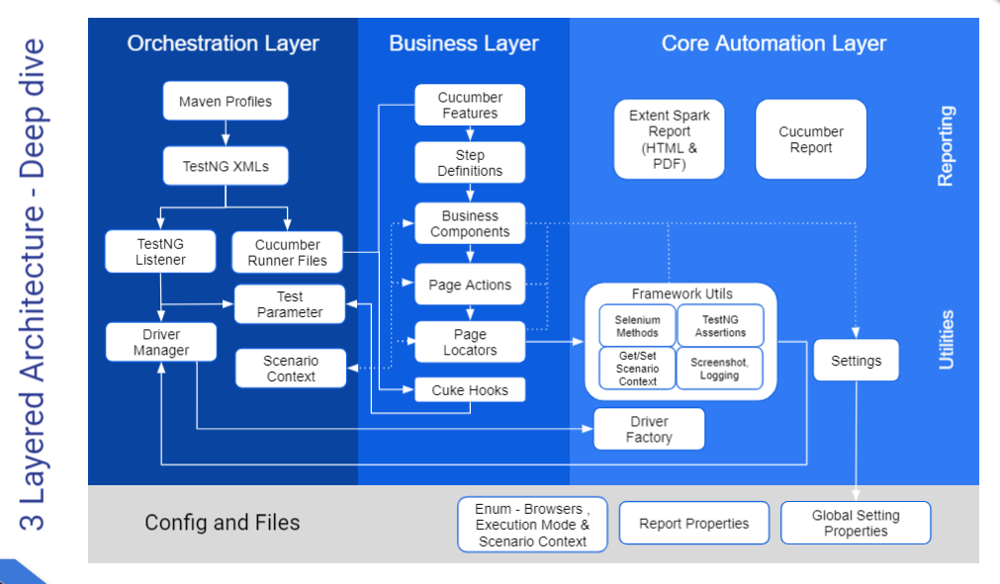

# Cognito Automation Test Framework (CAT Framework)

This is a hybrid framework built using different components - Selenium with Java Binding , TestNG , Cucumber using Page Object Model , Singleton and factory design pattern 
Driven by 3 Layered Architecture as follows,

## Steps to execute the Test

1. From command line / Integration with any devops pipeine (Azure, AWS, Jenkins etc..,) -
   mvn clean test -PrunRegressionTest ( make sure Java and maven are installed in the machine)

2. Using an IDE (Eclipse or Intellij ) -
   Run from the TestNG file in the path src/test/resources/TestNGXMLs/ (use RegressionTest.xml for regression tests and SmokeTest.xml for smoke tests)

3. Parallel execution can be achieved by modifying the data-provider-thread-count value in the testing XML file (Grid configurations yet to be done. However parallel execution in a single machine can be achieved )

## Reports

Extent - Spark HTML and PDF reports will be available in /target/Reports folder
Log4j logs will also be available in the /target/Reports folder

